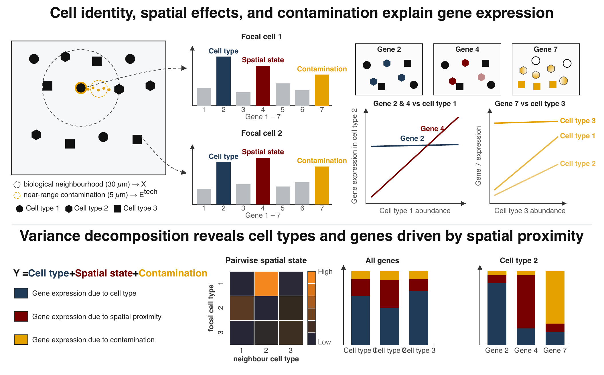

PACE
======================================================
A hierarchical empirical Bayes framework for `proximity-associated changes in expression` — how a cell's gene
expression shifts near specific neighbouring cell types — in `imaging-based spatial transcriptomics` (Xenium, CosMx).



Overview
--------

**PACE** quantifies how proximity to specific neighbouring cell types reshapes a cell's gene expression. It fits
hierarchical `negative binomial mixed models` with partial pooling across cell types, corrects for transcript
`contamination` between adjacent cells with a per-cell ambient term, and decomposes expression variance into
`cell-type identity`, `spatial cell state`, `contamination`, and `residual` components. A per-gene `driver score`
ranks the genes that mediate each focal–neighbour relationship.

Input and output follow [`SpatialExperiment`](https://bioconductor.org/packages/SpatialExperiment) conventions:
a single call to `paceFit()` returns a `PACEFit` object, read out with `neighbourSlopes()`,
`varianceDecomposition()`, and `topDrivers()`. See the package vignette for a worked breast cancer example.

Installation
--------
`PACE` requires a C++ compiler (via `Rcpp`/`RcppEigen`) for the contamination-correcting solver.

If you would like the most up-to-date features, install the development version from GitHub.
```
# install.packages("BiocManager")
BiocManager::install("remotes")
remotes::install_github("ecool50/PACE")
library(PACE)
```

### Submitting an issue or feature request

`PACE` is still under active development. We would greatly appreciate any and
all feedback related to the package.

* R package related issues should be raised [here](https://github.com/ecool50/PACE/issues).
* For general questions and feedback, please contact us directly via [ewil3501@uni.sydney.edu.au](mailto:ewil3501@uni.sydney.edu.au).


## Author

* **Elijah Willie**
* **Shreya Rajesh Rao**
* **John Ormerod**
* **Ellis Patrick**  - [@TheEllisPatrick](https://twitter.com/TheEllisPatrick)
