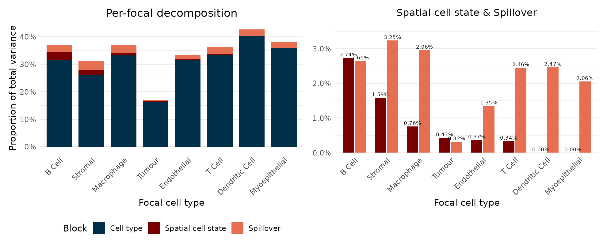
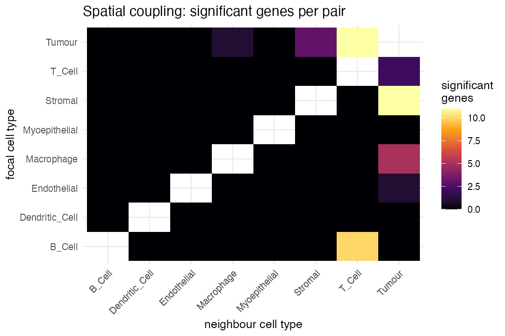
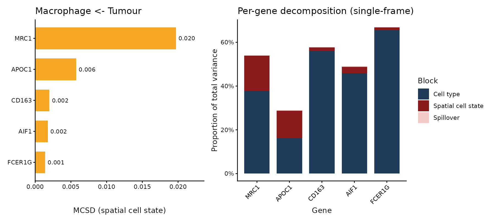
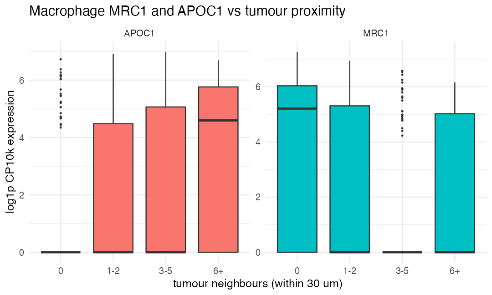

# PACE package manual

## Installation

``` r

if (!require("BiocManager")) install.packages("BiocManager")
BiocManager::install("remotes")
remotes::install_github("ecool50/PACE")
```

## Introduction

*[PACE](https://bioconductor.org/packages/3.23/PACE)*
(Proximity-Associated Changes in Expression) is a framework for
imaging-based spatial transcriptomics (such as Xenium and CosMx) that
quantifies how a cell’s gene expression changes with proximity to
*specific* neighbouring cell types. Rather than asking only which genes
are spatially variable, PACE asks a directed question: when a macrophage
sits next to tumour cells, which of its genes go up or down, and by how
much?

PACE fits a hierarchical negative binomial mixed model with partial
pooling across cell types, so that each focal-neighbour relationship
borrows strength from the others and noisy pairs are regularised towards
the consensus. A per-cell contamination term absorbs the short-range
ambient signal that leaks between adjacent cells through segmentation
error, so the estimated neighbour effect reflects biology rather than
transcript misassignment.

## Overview of the PACE workflow

A PACE analysis has three stages, all driven by the single call
[`paceFit()`](https://ecool50.github.io/PACE/reference/paceFit.md):

1.  **Neighbourhood construction.** For every cell, a Gaussian
    biological kernel summarises the abundance of each neighbouring cell
    type, and a short-range exponential technical kernel captures the
    ambient contamination field.
2.  **Model fitting.** A streaming penalised quasi-likelihood fit
    estimates, for every gene and every focal cell type, a partially
    pooled slope on each neighbour type’s abundance, jointly with a
    per-cell contamination loading and gene-wise overdispersions. The
    neighbour slopes are then stabilised by multivariate adaptive
    shrinkage.
3.  **Interpretation.** The fit is read out three ways: shrunken
    neighbour slopes with a local false sign rate
    ([`neighbourSlopes()`](https://ecool50.github.io/PACE/reference/neighbourSlopes.md)),
    a per-gene variance decomposition
    ([`varianceDecomposition()`](https://ecool50.github.io/PACE/reference/varianceDecomposition.md)),
    and per-pair driver-score tables ranking the genes that mediate each
    relationship
    ([`topDrivers()`](https://ecool50.github.io/PACE/reference/topDrivers.md)).

## The breast cancer dataset

The package ships a small worked example: a spatial crop of a human
breast cancer Xenium section (10x Genomics; nucleus segmentation, cell
types annotated with scClassify), centred on a tumour-macrophage
interface. It contains 7,898 cells across eight cell types (B cell,
dendritic cell, endothelial, macrophage, myoepithelial, stromal, T cell,
and tumour) and a 278-gene panel, packaged as a
*[SpatialExperiment](https://bioconductor.org/packages/3.23/SpatialExperiment)*.
This region reproduces the macrophage reprogramming that PACE identifies
on the full section.

``` r

library(PACE)
library(SpatialExperiment)
library(ggplot2)
library(dplyr)
library(tidyr)

spe <- readRDS(system.file("extdata", "bc_xenium_subset.rds", package = "PACE"))
spe
#> class: SpatialExperiment 
#> dim: 278 7898 
#> metadata(0):
#> assays(1): counts
#> rownames(278): SEC11C DAPK3 ... NOSTRIN CD1C
#> rowData names(0):
#> colnames(7898): 442 444 ... 99842 99848
#> colData names(2): cellType sample_id
#> reducedDimNames(0):
#> mainExpName: NULL
#> altExpNames(0):
#> spatialCoords names(2) : x y
#> imgData names(0):
table(spe$cellType)
#> 
#>         B_Cell Dendritic_Cell    Endothelial     Macrophage  Myoepithelial 
#>            330             32            499            591             47 
#>        Stromal         T_Cell         Tumour 
#>            681           1076           4642
```

## Fitting the model

[`paceFit()`](https://ecool50.github.io/PACE/reference/paceFit.md) reads
the counts, spatial coordinates, and cell-type labels from the
`SpatialExperiment` and runs the whole pipeline. On this crop it takes
about half a minute.

``` r

fit <- paceFit(spe,
               celltype_col  = "cellType",
               contamination = "percell_hc",   # per-cell contamination correction
               dispersion    = "nb1",
               verbose       = FALSE)
#>  - Computing 278 x 313 likelihood matrix.
#>  - Likelihood calculations took 0.09 seconds.
#>  - Fitting model with 313 mixture components.
#>  - Model fitting took 0.10 seconds.
#>  - Computing posterior matrices.
#>  - Computation allocated took 0.00 seconds.
#>  - Computing 278 x 92 likelihood matrix.
#>  - Likelihood calculations took 0.02 seconds.
#>  - Fitting model with 92 mixture components.
#>  - Model fitting took 0.03 seconds.
#>  - Computing posterior matrices.
#>  - Computation allocated took 0.00 seconds.
#>  - Computing 278 x 404 likelihood matrix.
#>  - Likelihood calculations took 0.11 seconds.
#>  - Fitting model with 404 mixture components.
#>  - Model fitting took 0.14 seconds.
#>  - Computing posterior matrices.
#>  - Computation allocated took 0.00 seconds.
#>  - Computing 278 x 417 likelihood matrix.
#>  - Likelihood calculations took 0.11 seconds.
#>  - Fitting model with 417 mixture components.
#>  - Model fitting took 0.21 seconds.
#>  - Computing posterior matrices.
#>  - Computation allocated took 0.00 seconds.
#>  - Computing 278 x 92 likelihood matrix.
#>  - Likelihood calculations took 0.00 seconds.
#>  - Fitting model with 92 mixture components.
#>  - Model fitting took 0.03 seconds.
#>  - Computing posterior matrices.
#>  - Computation allocated took 0.00 seconds.
#>  - Computing 278 x 391 likelihood matrix.
#>  - Likelihood calculations took 0.11 seconds.
#>  - Fitting model with 391 mixture components.
#>  - Model fitting took 0.12 seconds.
#>  - Computing posterior matrices.
#>  - Computation allocated took 0.00 seconds.
#>  - Computing 278 x 430 likelihood matrix.
#>  - Likelihood calculations took 0.12 seconds.
#>  - Fitting model with 430 mixture components.
#>  - Model fitting took 0.13 seconds.
#>  - Computing posterior matrices.
#>  - Computation allocated took 0.00 seconds.
#>  - Computing 278 x 628 likelihood matrix.
#>  - Likelihood calculations took 0.17 seconds.
#>  - Fitting model with 628 mixture components.
#>  - Model fitting took 0.17 seconds.
#>  - Computing posterior matrices.
#>  - Computation allocated took 0.00 seconds.
#>  - Computing 278 x 404 likelihood matrix.
#>  - Likelihood calculations took 0.11 seconds.
#>  - Fitting model with 404 mixture components.
#>  - Model fitting took 0.36 seconds.
#>  - Computing posterior matrices.
#>  - Computation allocated took 0.01 seconds.
#>  - Computing 278 x 590 likelihood matrix.
#>  - Likelihood calculations took 0.16 seconds.
#>  - Fitting model with 590 mixture components.
#>  - Model fitting took 0.56 seconds.
#>  - Computing posterior matrices.
#>  - Computation allocated took 0.01 seconds.
fit
#> class: PACEFit
#> cell types (8): B_Cell, Dendritic_Cell, Endothelial, Macrophage, Myoepithelial, Stromal, T_Cell, Tumour
#> kernels: h_bio = 30 um, h_tech = 5 um | contamination: percell_hc; dispersion: nb1
#> pipeline: model -> shrink -> decompose -> drivers
#>   neighbour slopes: 17792 rows (61 at lfsr < 0.05)
```

### The pipeline step by step

[`paceFit()`](https://ecool50.github.io/PACE/reference/paceFit.md) is a
convenience wrapper. The same result is produced by calling each step
explicitly, which lets you inspect the fitted model and re-run the
downstream layers (shrinkage, decomposition, drivers) without refitting:

``` r

fit <- paceModel(spe, celltype_col = "cellType")   |>  # fit the mixed model
       paceShrink()                                |>  # shrink neighbour slopes
       paceDecompose(spe)                          |>  # variance decomposition
       paceDrivers()                                   # per-pair driver scores
```

The fit-construction primitives expose the neighbourhood and
contamination field directly, for inspection independently of a fit:

``` r

kern <- buildNeighbourhood(spe, "cellType")   # Gaussian K_bio + technical K_tech
W    <- ambientField(spe, "cellType")         # sparse E^tech contamination field
anchorGenes(fit, spe)                         # per-cell-type contamination anchors
```

## Variance decomposition

[`plotDecomposition()`](https://ecool50.github.io/PACE/reference/plotDecomposition.md)
shows, for each focal cell type, the share of expression variance
attributable to cell-type identity, spatial cell state (proximity
effects), and contamination (spillover), pooled over genes. The left
panel is the full stacked bar; the right zooms in on the two small
spatial components.

``` r

plotDecomposition(fit)
```



Beyond the dominant cell-type identity component, B cells, stromal cells
and macrophages carry the largest spatial cell-state contributions,
while dendritic and myoepithelial cells carry none on this crop. The
underlying per-gene table is available with
`varianceDecomposition(fit)`.

## Per-cell contamination

The spillover component above is a variance share per gene.
[`cellContamination()`](https://ecool50.github.io/PACE/reference/cellContamination.md)
gives the per-cell view of the same term: the loading `rho_i` and, more
usefully, `contamFraction`, the share of a cell’s expected counts
attributed to its local ambient field. A high fraction marks a cell
whose profile is largely explained by its neighbours rather than by its
own type, which is what a segmentation or transcript-assignment error
looks like.

``` r

cc <- cellContamination(fit)
head(cc, 3)
#>   cell   celltype        rho contamFraction
#> 1  442     Tumour 0.11504406    0.000000000
#> 2  444     B_Cell 0.00282706    0.001557513
#> 3  446 Macrophage 0.58779262    0.123800291
round(tapply(cc$contamFraction, cc$celltype, median), 3)
#>         B_Cell Dendritic_Cell    Endothelial     Macrophage  Myoepithelial 
#>          0.091          0.083          0.018          0.073          0.038 
#>        Stromal         T_Cell         Tumour 
#>          0.038          0.072          0.000
```

Read the fraction rather than the loading. The ambient field is
cross-cell-type, so a cell with no differently-typed neighbour inside
the technical kernel has no ambient signal at all; its `rho_i` is
unidentified and shrinks to the empirical Bayes prior mean, giving every
such cell the same apparently middling loading. On this crop that is
most of the tumour interior:

``` r

zero <- cc$contamFraction == 0
c(cells = sum(zero), distinct_rho = length(unique(round(cc$rho[zero], 12))))
#>        cells distinct_rho 
#>         4589            1
round(tapply(zero, cc$celltype, mean), 2)
#>         B_Cell Dendritic_Cell    Endothelial     Macrophage  Myoepithelial 
#>           0.10           0.16           0.26           0.19           0.23 
#>        Stromal         T_Cell         Tumour 
#>           0.30           0.18           0.84
```

`contamFraction` reports those cells as zero, which is correct; `rho`
alone does not.

## Pairwise spatial interactions

[`plotPairHeatmap()`](https://ecool50.github.io/PACE/reference/plotPairHeatmap.md)
gives the percentage of each focal type’s total variance contributed by
spatial interaction with each neighbour, computed as the focal’s spatial
share split across neighbours by a normalised Pratt attribution.
**Tumour as a neighbour** acts the most widely across the
microenvironment, reaching four focal types where no other neighbour
reaches more than two. The single strongest pair is B cells next to T
cells.

``` r

plotPairHeatmap(fit)
```



[`pairVariance()`](https://ecool50.github.io/PACE/reference/pairVariance.md)
returns those same numbers as a long table. The heatmap is drawn from
it, so the two cannot disagree, and the table is the easier thing to
rank or pass on:

``` r

pairVariance(fit) |>
  arrange(desc(val)) |>
  head(5)
#> # A tibble: 5 × 3
#>   focal       neighbour   val
#>   <chr>       <chr>     <dbl>
#> 1 B_Cell      T_Cell    2.73 
#> 2 Stromal     Tumour    1.59 
#> 3 Macrophage  Tumour    0.756
#> 4 Endothelial Tumour    0.372
#> 5 Tumour      T_Cell    0.342
```

For a cohort with a condition, `block = "responder"` gives the same
attribution for the responder-by-proximity block rather than the
baseline spatial one.

## Macrophage–tumour drivers

[`plotDrivers()`](https://ecool50.github.io/PACE/reference/plotDrivers.md)
ranks the genes mediating a relationship by a driver score (MCSD,
combining the shrunken slope, its cell-type specificity, and its
expression level), alongside their per-gene single-frame decomposition.
For the macrophage-tumour pair, the top drivers are the tissue-resident
marker **MRC1** (CD206), reduced near tumour, and the lipid-associated
marker **APOC1**, elevated near tumour.

``` r

plotDrivers(fit, "Macrophage", "Tumour")
```



The shrunken slopes confirm the opposing directions:

``` r

neighbourSlopes(fit) |>
  filter(focal == "Macrophage", neighbour == "Tumour",
         gene %in% c("MRC1", "APOC1")) |>
  select(gene, estimate_shrunk, lfsr)
#>    gene estimate_shrunk         lfsr
#> 1 APOC1       0.1301689 1.077054e-17
#> 2  MRC1      -0.1494760 1.443290e-15
```

## Visualising the proximity effect

[`plotProximity()`](https://ecool50.github.io/PACE/reference/plotProximity.md)
bins each macrophage by its number of tumour neighbours (within 30 um)
and shows each gene’s raw counts per bin. Because these genes are
zero-inflated the box median sits at zero in most bins, so the per-bin
mean is overlaid as a point to make the trend explicit. Macrophage MRC1
falls and APOC1 rises with tumour proximity.

``` r

plotProximity(fit, spe, c("MRC1", "APOC1"), "Macrophage", "Tumour")
```



## Biological interpretation

On this section PACE recovers a coordinated shift in macrophage state at
the tumour interface: the tissue-resident marker MRC1 (CD206) is reduced
and the lipid-associated, immunosuppressive marker APOC1 is elevated in
macrophages near tumour cells. Because PACE separates this proximity
effect from the transcript contamination that would otherwise inflate
tumour-marker signal in the macrophages, the drivers it promotes are
genuine macrophage genes rather than tumour genes bleeding across cell
boundaries.

## Saving a fit

A fit holds the fitted means and the contamination log-offset as full
`cells x genes` matrices. They make the object large: even this small
crop is

``` r

round(as.numeric(object.size(fit)) / 1e6, 1)   # MB
#> [1] 59.8
```

and a whole section runs to several hundred megabytes. They do not have
to be kept.
[`paceDecompose()`](https://ecool50.github.io/PACE/reference/paceDecompose.md)
rebuilds them from the fit and the `SpatialExperiment`, exactly, so a
fit can be saved without them and still be re-decomposed:

``` r

fit_small <- fit
for (nm in c("mu", "technical_offset_mat", "bleed_offset_mat"))
  fit_small@fit[[nm]] <- NULL
round(as.numeric(object.size(fit_small)) / 1e6, 1)   # MB
#> [1] 7.1
```

``` r

saveRDS(fit_small, "fit.rds", compress = "xz")
```

Every readout above still works on the stripped fit, and re-decomposing
it reproduces the table it already carries:

``` r

redone <- paceDecompose(fit_small, spe)
stored <- varianceDecomposition(fit)
num <- vapply(stored, is.numeric, logical(1))
max(abs(as.matrix(varianceDecomposition(redone)[num]) - as.matrix(stored[num])))
#> [1] 0
```

## Session info

``` r

sessionInfo()
#> R version 4.6.1 (2026-06-24)
#> Platform: x86_64-pc-linux-gnu
#> Running under: Ubuntu 24.04.4 LTS
#> 
#> Matrix products: default
#> BLAS:   /usr/lib/x86_64-linux-gnu/openblas-pthread/libblas.so.3 
#> LAPACK: /usr/lib/x86_64-linux-gnu/openblas-pthread/libopenblasp-r0.3.26.so;  LAPACK version 3.12.0
#> 
#> locale:
#>  [1] LC_CTYPE=C.UTF-8       LC_NUMERIC=C           LC_TIME=C.UTF-8       
#>  [4] LC_COLLATE=C.UTF-8     LC_MONETARY=C.UTF-8    LC_MESSAGES=C.UTF-8   
#>  [7] LC_PAPER=C.UTF-8       LC_NAME=C              LC_ADDRESS=C          
#> [10] LC_TELEPHONE=C         LC_MEASUREMENT=C.UTF-8 LC_IDENTIFICATION=C   
#> 
#> time zone: UTC
#> tzcode source: system (glibc)
#> 
#> attached base packages:
#> [1] stats4    stats     graphics  grDevices utils     datasets  methods  
#> [8] base     
#> 
#> other attached packages:
#>  [1] tidyr_1.3.2                 dplyr_1.2.1                
#>  [3] ggplot2_4.0.3               SpatialExperiment_1.22.0   
#>  [5] SingleCellExperiment_1.34.0 SummarizedExperiment_1.42.0
#>  [7] Biobase_2.72.0              GenomicRanges_1.64.0       
#>  [9] Seqinfo_1.2.0               IRanges_2.46.0             
#> [11] S4Vectors_0.50.2            BiocGenerics_0.58.1        
#> [13] generics_0.1.4              MatrixGenerics_1.24.0      
#> [15] matrixStats_1.5.0           PACE_0.99.1                
#> [17] BiocStyle_2.40.0           
#> 
#> loaded via a namespace (and not attached):
#>  [1] tidyselect_1.2.1    viridisLite_0.4.3   farver_2.1.2       
#>  [4] S7_0.2.2            fastmap_1.2.0       digest_0.6.39      
#>  [7] lifecycle_1.0.5     invgamma_1.2        magrittr_2.0.5     
#> [10] dbscan_1.2.6        compiler_4.6.1      rlang_1.3.0        
#> [13] sass_0.4.10         tools_4.6.1         utf8_1.2.6         
#> [16] yaml_2.3.12         knitr_1.52          S4Arrays_1.12.0    
#> [19] labeling_0.4.3      DelayedArray_0.38.2 plyr_1.8.9         
#> [22] RColorBrewer_1.1-3  abind_1.4-8         BiocParallel_1.46.0
#> [25] withr_3.0.3         purrr_1.2.2         desc_1.4.3         
#> [28] grid_4.6.1          scales_1.4.0        cli_3.6.6          
#> [31] mvtnorm_1.4-2       rmarkdown_2.32      ragg_1.5.2         
#> [34] otel_0.2.0          rjson_0.2.23        cachem_1.1.0       
#> [37] stringr_1.6.0       assertthat_0.2.1    parallel_4.6.1     
#> [40] BiocManager_1.30.27 XVector_0.52.0      vctrs_0.7.3        
#> [43] Matrix_1.7-5        jsonlite_2.0.0      bookdown_0.48      
#> [46] patchwork_1.3.2     mixsqp_0.3-54       irlba_2.3.7        
#> [49] systemfonts_1.3.2   magick_2.9.1        jquerylib_0.1.4    
#> [52] glue_1.8.1          pkgdown_2.2.1       codetools_0.2-20   
#> [55] stringi_1.8.9       gtable_0.3.6        rmeta_3.0          
#> [58] tibble_3.3.1        pillar_1.11.1       htmltools_0.5.9    
#> [61] truncnorm_1.0-9     R6_2.6.1            mashr_0.2.79       
#> [64] textshaping_1.0.5   evaluate_1.0.5      lattice_0.22-9     
#> [67] SQUAREM_2026.1      ashr_2.2-63         bslib_0.12.0       
#> [70] Rcpp_1.1.2          SparseArray_1.12.2  xfun_0.60          
#> [73] fs_2.1.0            pkgconfig_2.0.3
```
