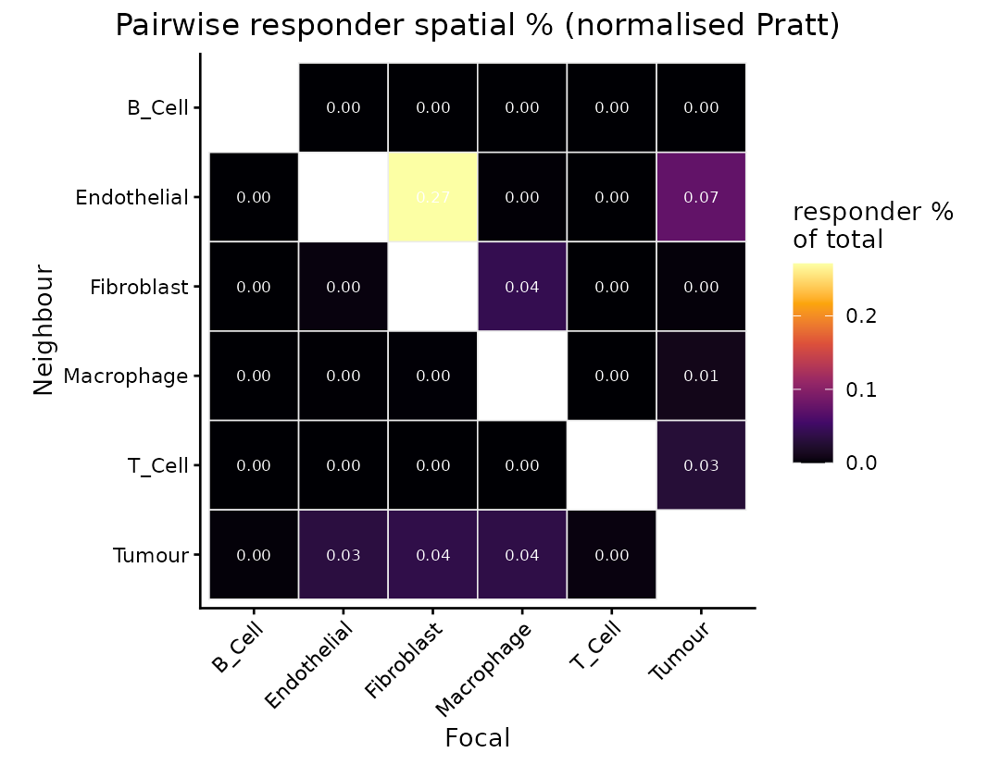
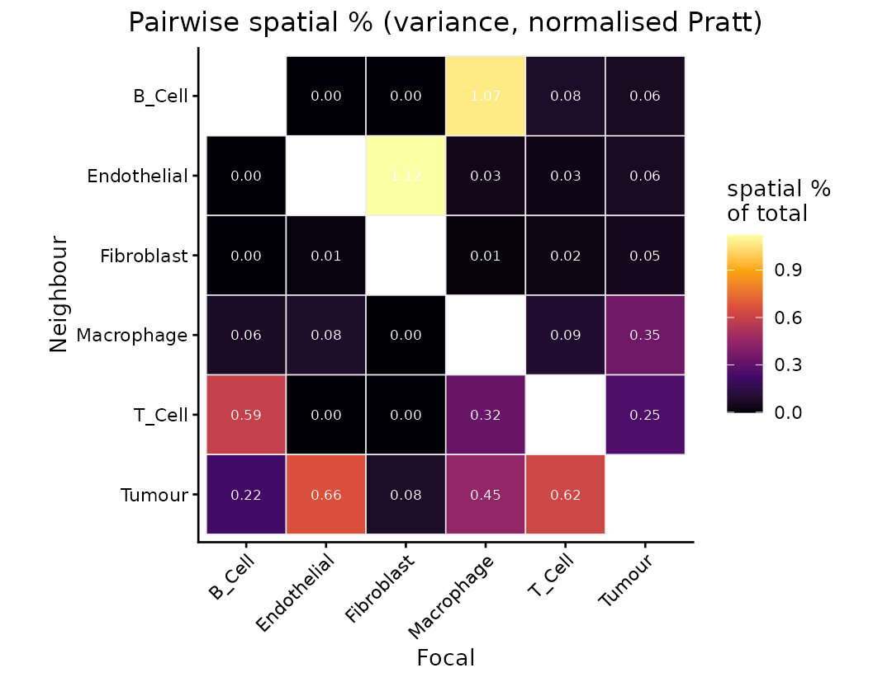
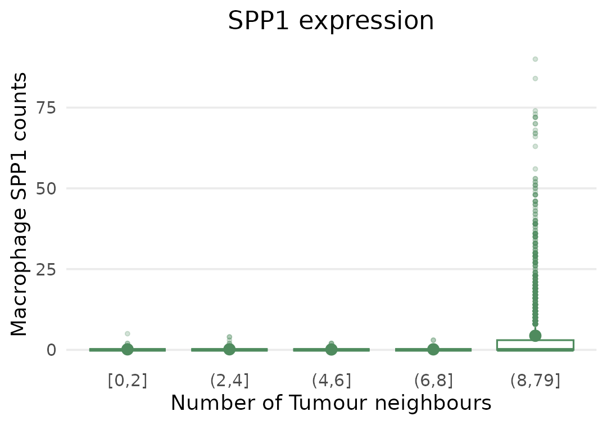
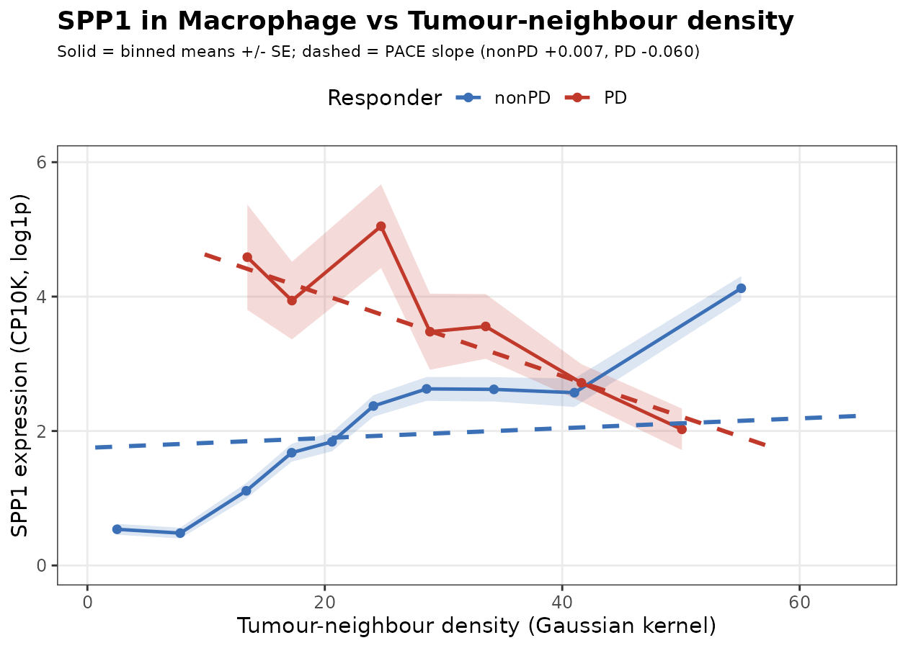
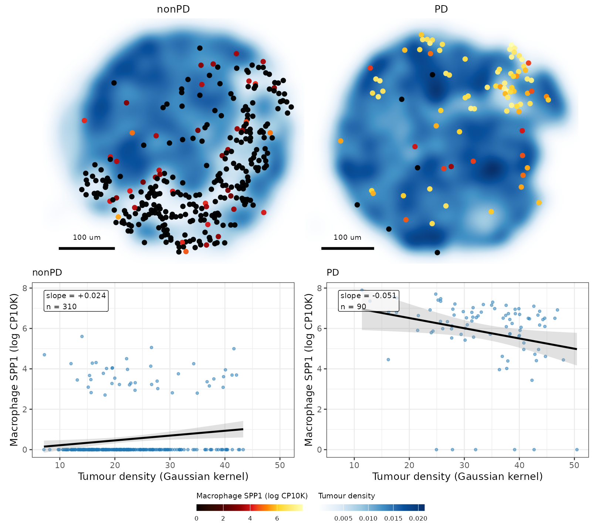

# Comparing proximity effects between conditions

## Introduction

The *[PACE](https://bioconductor.org/packages/3.23/PACE)* manual fits
one section. This vignette asks whether a proximity effect differs
between two groups of patients.

That needs a cohort, and adds one block to the model. Beside the spatial
cell state block, the proximity effect common to both arms, PACE
estimates a **responder spatial state** block: the part that differs
between them.

## The melanoma subset

The package ships a subset of a CosMx melanoma cohort of patients
profiled after immune checkpoint blockade, contrasting progressive
disease (PD) against non-progressive disease (non-PD, pooling stable,
partial and complete responders).

``` r

library(PACE)
library(SpatialExperiment)
library(ggplot2)
library(dplyr)

spe <- readRDS(system.file("extdata", "mel_cosmx_subset.rds", package = "PACE"))
spe
#> class: SpatialExperiment 
#> dim: 180 56274 
#> metadata(0):
#> assays(1): counts
#> rownames(180): ANXA2 APOD ... WIF1 YBX3
#> rowData names(0):
#> colnames(56274): Cell52866 Cell52867 ... Cell21744 Cell21745
#> colData names(4): cellType Responder image sample_id
#> reducedDimNames(0):
#> mainExpName: NULL
#> altExpNames(0):
#> spatialCoords names(2) : x y
#> imgData names(0):
table(spe$cellType)
#> 
#>      B_Cell Endothelial  Fibroblast  Macrophage      T_Cell      Tumour 
#>        1129        1261        1488        3101        3406       45889
table(unique(data.frame(image = spe$image, arm = spe$Responder))$arm)
#> 
#> nonPD    PD 
#>    19     7
```

One section per patient, so the contrast is between patients.

Every cell and patient of the published cohort is here; only the panel
is reduced, to the 180 most detected of 927 genes. Derivation:
`inst/scripts/make-mel-cosmx-subset.R`.

> **Provenance.** These data are a subset of the deposit accompanying
> Dong, Su, Kluger, Fan and Kluger, *SIMVI disentangles intrinsic and
> spatial-induced cellular states in spatial omics data*
> ([doi:10.5281/zenodo.14708000](https://doi.org/10.5281/zenodo.14708000)),
> used here under CC-BY-4.0.

## Fitting with a condition

Three arguments beyond the single-section call:

- `condition_col` names the contrast and switches on the responder
  block.
- `kernel_per_image = TRUE` keeps neighbourhoods within a section, so no
  cell neighbours another patient’s.
- `image_re = "intercept"` absorbs patient-level shifts in overall
  expression.

``` r

fit <- paceFit(spe,
               celltype_col     = "cellType",
               condition_col    = "Responder",
               image_col        = "image",
               kernel_per_image = TRUE,
               image_re         = "intercept",
               dispersion       = "nb1",
               verbose          = FALSE)
#>  - Computing 180 x 298 likelihood matrix.
#>  - Likelihood calculations took 0.04 seconds.
#>  - Fitting model with 298 mixture components.
#>  - Model fitting took 0.14 seconds.
#>  - Computing posterior matrices.
#>  - Computation allocated took 0.00 seconds.
#>  - Computing 180 x 375 likelihood matrix.
#>  - Likelihood calculations took 0.05 seconds.
#>  - Fitting model with 375 mixture components.
#>  - Model fitting took 0.26 seconds.
#>  - Computing posterior matrices.
#>  - Computation allocated took 0.00 seconds.
#>  - Computing 180 x 579 likelihood matrix.
#>  - Likelihood calculations took 0.07 seconds.
#>  - Fitting model with 579 mixture components.
#>  - Model fitting took 0.53 seconds.
#>  - Computing posterior matrices.
#>  - Computation allocated took 0.00 seconds.
#>  - Computing 180 x 364 likelihood matrix.
#>  - Likelihood calculations took 0.05 seconds.
#>  - Fitting model with 364 mixture components.
#>  - Model fitting took 0.22 seconds.
#>  - Computing posterior matrices.
#>  - Computation allocated took 0.00 seconds.
#>  - Computing 180 x 243 likelihood matrix.
#>  - Likelihood calculations took 0.03 seconds.
#>  - Fitting model with 243 mixture components.
#>  - Model fitting took 0.13 seconds.
#>  - Computing posterior matrices.
#>  - Computation allocated took 0.00 seconds.
#>  - Computing 180 x 375 likelihood matrix.
#>  - Likelihood calculations took 0.05 seconds.
#>  - Fitting model with 375 mixture components.
#>  - Model fitting took 0.30 seconds.
#>  - Computing posterior matrices.
#>  - Computation allocated took 0.00 seconds.
#>  - Computing 180 x 364 likelihood matrix.
#>  - Likelihood calculations took 0.05 seconds.
#>  - Fitting model with 364 mixture components.
#>  - Model fitting took 0.10 seconds.
#>  - Computing posterior matrices.
#>  - Computation allocated took 0.00 seconds.
#>  - Computing 180 x 562 likelihood matrix.
#>  - Likelihood calculations took 0.07 seconds.
#>  - Fitting model with 562 mixture components.
#>  - Model fitting took 0.15 seconds.
#>  - Computing posterior matrices.
#>  - Computation allocated took 0.00 seconds.
#>  - Computing 180 x 265 likelihood matrix.
#>  - Likelihood calculations took 0.03 seconds.
#>  - Fitting model with 265 mixture components.
#>  - Model fitting took 0.23 seconds.
#>  - Computing posterior matrices.
#>  - Computation allocated took 0.00 seconds.
#>  - Computing 180 x 409 likelihood matrix.
#>  - Likelihood calculations took 0.05 seconds.
#>  - Fitting model with 409 mixture components.
#>  - Model fitting took 0.62 seconds.
#>  - Computing posterior matrices.
#>  - Computation allocated took 0.00 seconds.
fit
#> class: PACEFit
#> cell types (6): B_Cell, Endothelial, Fibroblast, Macrophage, T_Cell, Tumour
#> kernels: h_bio = 30 um, h_tech = 5 um | contamination: percell_hc; dispersion: nb1
#> condition: Responder (ResponderPD)
#> pipeline: model -> shrink -> decompose -> drivers
#>   neighbour slopes: 6480 rows (76 at lfsr < 0.05)
```

The interaction term is named from the non-reference level of
`condition_col`:

``` r

fit@params$resp_term
#> [1] "ResponderPD"
```

so `ResponderPD:Tumour` is the extra change in expression per unit of
tumour proximity in the PD arm, on top of the `Tumour` effect shared by
both arms.

## The responder block in the decomposition

[`varianceDecomposition()`](https://ecool50.github.io/PACE/reference/varianceDecomposition.md)
now carries a `Responder spatial %` column beside the `Spatial %` one:

``` r

varianceDecomposition(fit) |>
  group_by(focal) |>
  summarise(`Spatial %`           = round(median(`Spatial %`), 4),
            `Responder spatial %` = round(median(`Responder spatial %`), 4),
            `Spillover %`         = round(median(`Spillover %`), 2),
            .groups = "drop")
#> # A tibble: 6 × 4
#>   focal       `Spatial %` `Responder spatial %` `Spillover %`
#>   <chr>             <dbl>                 <dbl>         <dbl>
#> 1 B_Cell            0.230                0.0005          12.1
#> 2 Endothelial       0.238                0.0242          13.9
#> 3 Fibroblast        0.343                0.0762          18.4
#> 4 Macrophage        0.478                0.025           19.6
#> 5 T_Cell            0.317                0.0019          13  
#> 6 Tumour            0.307                0.034            3.2
```

The responder block is much the smaller: most of a cell’s response to
its neighbours is common to both arms. Contamination exceeds both, and
is largest in the sparse immune populations.

## Which pairs carry the condition difference

[`pairVariance()`](https://ecool50.github.io/PACE/reference/pairVariance.md)
and
[`plotPairHeatmap()`](https://ecool50.github.io/PACE/reference/plotPairHeatmap.md)
both take `block = "responder"`, which attributes the responder block
across neighbours instead of the shared spatial one:

``` r

pairVariance(fit, block = "responder") |>
  arrange(desc(val)) |>
  head(5)
#> # A tibble: 5 × 3
#>   focal      neighbour      val
#>   <chr>      <chr>        <dbl>
#> 1 Fibroblast Endothelial 0.271 
#> 2 Tumour     Endothelial 0.0741
#> 3 Macrophage Fibroblast  0.0417
#> 4 Fibroblast Tumour      0.0380
#> 5 Macrophage Tumour      0.0365

plotPairHeatmap(fit, block = "responder")
```



Fibroblast next to endothelium takes the largest share. Compare the
shared spatial block, which orders differently:

``` r

plotPairHeatmap(fit, block = "spatial")
```



## The genes that carry it

Pair shares say where to look,
[`neighbourSlopes()`](https://ecool50.github.io/PACE/reference/neighbourSlopes.md)
which genes. The `ResponderPD:` terms differ between arms:

``` r

ns <- neighbourSlopes(fit)
resp <- subset(ns, grepl("^ResponderPD:", term) & lfsr < 0.05)
nrow(resp)
#> [1] 76

resp[order(resp$lfsr), c("gene", "focal", "neighbour", "estimate_shrunk", "lfsr")] |>
  head(8)
#>        gene      focal   neighbour estimate_shrunk         lfsr
#> 2053   GLUL     Tumour Endothelial     -0.39965573 0.000000e+00
#> 6100   SPP1 Macrophage      Tumour     -0.06630620 0.000000e+00
#> 5351    MX1     Tumour      T_Cell      0.23157932 7.979372e-53
#> 5317 IFITM1     Tumour      T_Cell      0.18729859 4.405081e-33
#> 6373   GLUL     Tumour      Tumour      0.01628370 2.387829e-23
#> 5226    B2M     Tumour      T_Cell      0.10499260 6.530095e-23
#> 5383  STAT1     Tumour      T_Cell      0.14030844 2.374834e-22
#> 6401 IGFBP7     Tumour      Tumour      0.01674059 6.350817e-22
```

Among the strongest is *SPP1* in macrophages next to tumour cells:

``` r

subset(ns, gene == "SPP1" & focal == "Macrophage" & neighbour == "Tumour")
#>      gene      focal neighbour               term    estimate   std.error
#> 6100 SPP1 Macrophage    Tumour ResponderPD:Tumour -0.06738867 0.006192822
#>      estimate_shrunk   sd_shrunk lfsr
#> 6100      -0.0663062 0.006056031    0
```

`Tumour` is the response shared by both arms; `ResponderPD:Tumour` is
how much it differs in progressive disease. Negative, so macrophage
*SPP1* rises less steeply with tumour proximity when disease progressed.
This is the paper’s melanoma result.

The counts behind it, split by arm:

``` r

plotProximity(fit, spe, "SPP1", "Macrophage", "Tumour",
              breaks = c(0, 10, 20, 30, 40, Inf), condition = TRUE)
```



[`plotResponseCurve()`](https://ecool50.github.io/PACE/reference/plotResponseCurve.md)
puts the model over the data: solid lines are binned means and standard
errors, dashed lines the PACE slopes read from the fit.

``` r

plotResponseCurve(fit, spe, "SPP1", "Macrophage", "Tumour")
```



The dashed lines diverge; that divergence is the interaction. The x axis
is the model’s own covariate, so the slopes are drawn on the scale they
were estimated on.

[`plotResponseMap()`](https://ecool50.github.io/PACE/reference/plotResponseMap.md)
gives the spatial view, using the two sections shown in the paper:

``` r

plotResponseMap(fit, spe, "SPP1", "Macrophage", "Tumour",
                images = c(nonPD = "32157_18", PD = "32156_17"))
```



## Session info

``` r

sessionInfo()
#> R version 4.6.1 (2026-06-24)
#> Platform: x86_64-pc-linux-gnu
#> Running under: Ubuntu 24.04.5 LTS
#> 
#> Matrix products: default
#> BLAS:   /usr/lib/x86_64-linux-gnu/openblas-pthread/libblas.so.3 
#> LAPACK: /usr/lib/x86_64-linux-gnu/openblas-pthread/libopenblasp-r0.3.26.so;  LAPACK version 3.12.0
#> 
#> locale:
#>  [1] LC_CTYPE=C.UTF-8       LC_NUMERIC=C           LC_TIME=C.UTF-8       
#>  [4] LC_COLLATE=C.UTF-8     LC_MONETARY=C.UTF-8    LC_MESSAGES=C.UTF-8   
#>  [7] LC_PAPER=C.UTF-8       LC_NAME=C              LC_ADDRESS=C          
#> [10] LC_TELEPHONE=C         LC_MEASUREMENT=C.UTF-8 LC_IDENTIFICATION=C   
#> 
#> time zone: UTC
#> tzcode source: system (glibc)
#> 
#> attached base packages:
#> [1] stats4    stats     graphics  grDevices utils     datasets  methods  
#> [8] base     
#> 
#> other attached packages:
#>  [1] dplyr_1.2.1                 ggplot2_4.0.3              
#>  [3] SpatialExperiment_1.22.0    SingleCellExperiment_1.34.0
#>  [5] SummarizedExperiment_1.42.0 Biobase_2.72.0             
#>  [7] GenomicRanges_1.64.0        Seqinfo_1.2.0              
#>  [9] IRanges_2.46.0              S4Vectors_0.50.2           
#> [11] BiocGenerics_0.58.1         generics_0.1.4             
#> [13] MatrixGenerics_1.24.0       matrixStats_1.5.0          
#> [15] PACE_0.99.1                 BiocStyle_2.40.0           
#> 
#> loaded via a namespace (and not attached):
#>  [1] tidyselect_1.2.1    viridisLite_0.4.3   farver_2.1.2       
#>  [4] S7_0.2.2            fastmap_1.2.0       digest_0.6.39      
#>  [7] lifecycle_1.0.5     invgamma_1.2        magrittr_2.0.5     
#> [10] dbscan_1.2.6        compiler_4.6.1      rlang_1.3.0        
#> [13] sass_0.4.10         tools_4.6.1         utf8_1.2.6         
#> [16] yaml_2.3.12         knitr_1.52          S4Arrays_1.12.0    
#> [19] labeling_0.4.3      DelayedArray_0.38.2 plyr_1.8.9         
#> [22] RColorBrewer_1.1-3  abind_1.4-8         BiocParallel_1.46.0
#> [25] withr_3.0.3         purrr_1.2.2         desc_1.4.3         
#> [28] grid_4.6.1          scales_1.4.0        MASS_7.3-65        
#> [31] cli_3.6.6           mvtnorm_1.4-2       rmarkdown_2.32     
#> [34] ragg_1.5.2          otel_0.2.0          rjson_0.2.23       
#> [37] cachem_1.1.0        splines_4.6.1       assertthat_0.2.1   
#> [40] parallel_4.6.1      BiocManager_1.30.27 XVector_0.52.0     
#> [43] vctrs_0.7.3         Matrix_1.7-5        jsonlite_2.0.0     
#> [46] bookdown_0.48       patchwork_1.3.2     mixsqp_0.3-54      
#> [49] irlba_2.3.7         systemfonts_1.3.2   magick_2.9.1       
#> [52] jquerylib_0.1.4     tidyr_1.3.2         glue_1.8.1         
#> [55] pkgdown_2.2.1       codetools_0.2-20    gtable_0.3.6       
#> [58] rmeta_3.0           tibble_3.3.1        pillar_1.11.1      
#> [61] htmltools_0.5.9     truncnorm_1.0-9     R6_2.6.1           
#> [64] mashr_0.2.79        textshaping_1.0.5   evaluate_1.0.5     
#> [67] lattice_0.22-9      SQUAREM_2026.1      ashr_2.2-63        
#> [70] bslib_0.12.0        Rcpp_1.1.2          nlme_3.1-169       
#> [73] SparseArray_1.12.2  mgcv_1.9-4          xfun_0.60          
#> [76] fs_2.1.0            pkgconfig_2.0.3
```
